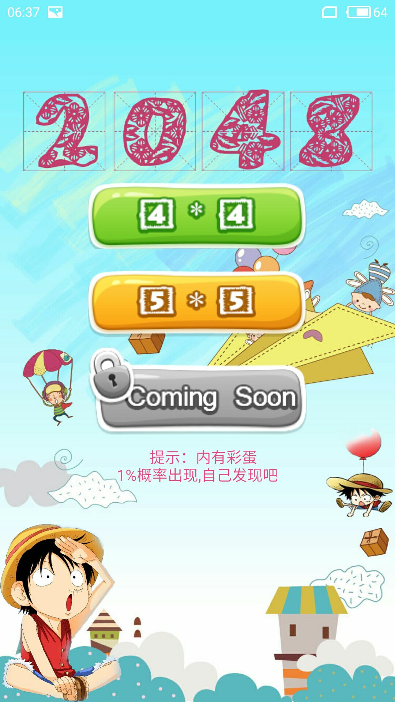
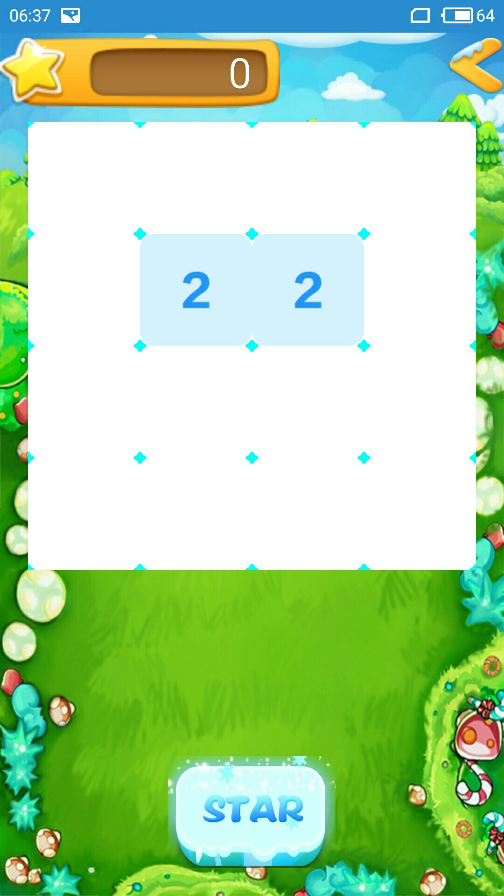
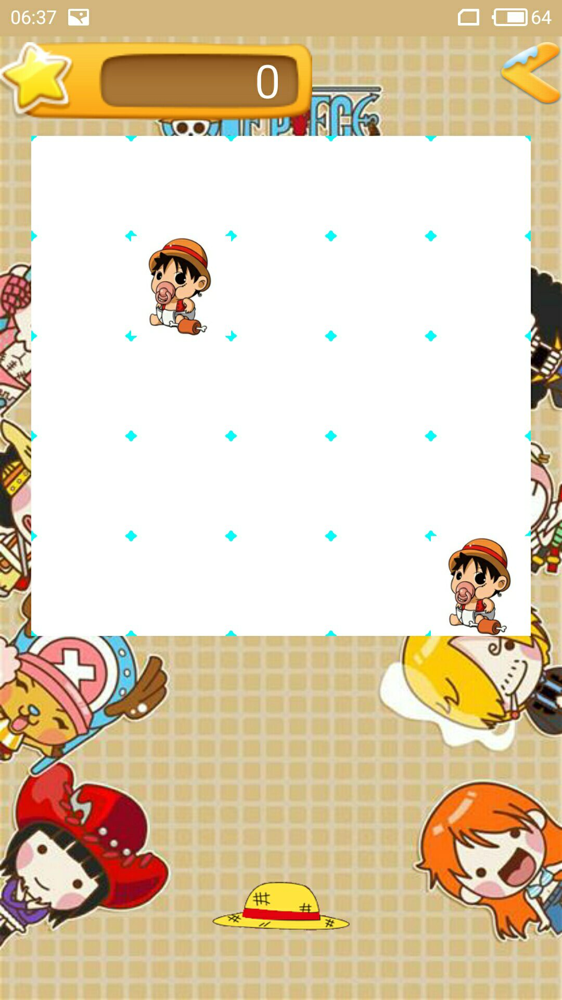
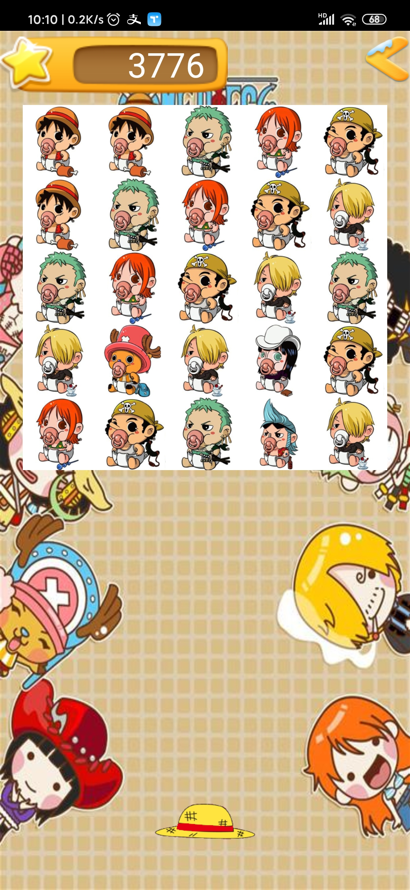

#### Android 带你玩转实现游戏2048海贼王主题

那是2017年的秋天，在学校的实验室自学安卓，看到鸿洋大佬的博客，

[Android 带你玩转实现游戏2048](https://blog.csdn.net/lmj623565791/article/details/40020137)，

吼吼，好嗨呦。所以才想自己也搞了一个。当时觉得博客里的那个主题也不是很好看，就在网上找了一套海贼王的素材包。开始自己搞一个。于是两天后一个海贼王主题的单机2048就诞生了。当时上某些课时就拿出来玩，故意摆弄给同学看，得瑟:smile:

代码质量不高，建议还是看鸿洋大佬的博客学习，不过此项目中的一些素材包还是可以拿去用的。

展示一些软件截图

